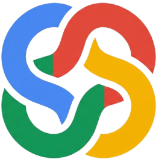
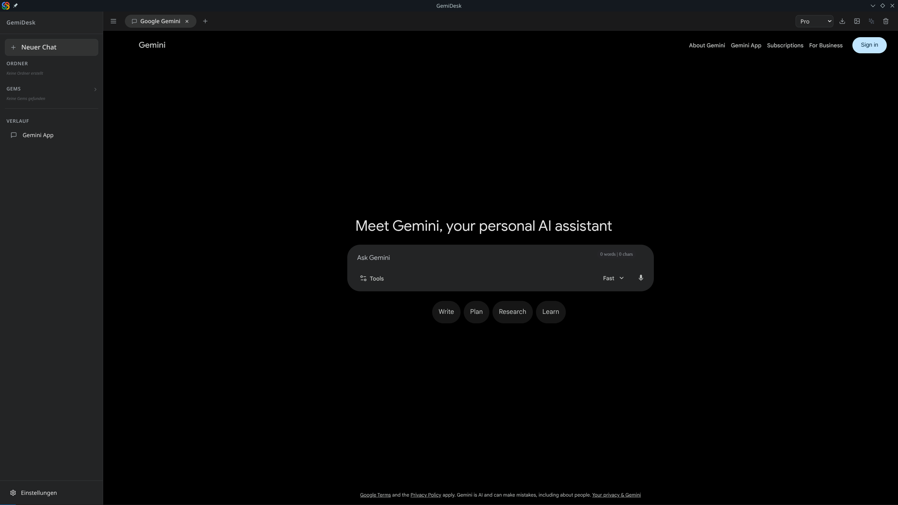

<p align="center">
  
</p>

<h1 align="center">GemiDesk</h1>

<p align="center">
  <strong>The Ultimate Native Desktop Experience for Google Gemini.</strong>
</p>

<p align="center">
  
  
  
  
</p>

---

<p align="center">
  
</p>

## 🌟 The Vision

In an era of AI-driven productivity, GemiDesk provides a focused, high-performance workspace dedicated to Google Gemini. It bridges the gap between web-based interfaces and native desktop integration, offering a distraction-free environment, deep system integration, and advanced organizational tools.

---

## 🚀 Key Features

| Feature | Description |
| :--- | :--- |
| **🗂️ Smart Folders** | Categorize conversations into logical groups (e.g., Projects, Research, Personal) for better workflow management. |
| **📑 Tabbed Interface** | Multi-task across multiple chats simultaneously with a native tab system. |
| **💎 Native Shell** | Optimized UI injection for a seamless, dark-themed experience that integrates with your desktop environment. |
| **📄 PDF Export** | Generate professionally formatted PDF exports of your conversations with a single click. |
| **✨ Prompt Enhancer** | Built-in utility to refine and optimize prompts for high-quality Gemini responses. |
| **🎯 Model Control** | Quickly switch between models (Pro, Flash, Thinking) with persistent session handling. |

---

## 🛠️ Installation (Nix)

GemiDesk is built for the future of Linux. We leverage **Nix** for a reproducible, reliable, and "works on my machine" experience.

### 📦 Official Nixpkgs (Upcoming)
GemiDesk is currently being prepared for inclusion in the official `nixpkgs` repository. Once available, you can install it simply by adding it to your configuration:

```nix
environment.systemPackages = [
  pkgs.gemidesk
];
```

### 💨 Quick Run (Flakes)
Test-drive GemiDesk without changing your system:
```bash
nix run github:TimH-DE/GemiDesk
```

### 💻 Local Development
If you want to contribute or build from source:
```bash
# Clone the repository
git clone https://github.com/TimH-DE/GemiDesk.git
cd GemiDesk

# Enter the reproducible dev shell
nix develop

# Start the app
npm install
npm run dev
```

### ❄️ System Integration (via Flakes)
Add GemiDesk to your `flake.nix` inputs:
```nix
inputs.gemidesk.url = "github:TimH-DE/GemiDesk";
```
Then add it to your system packages:
```nix
environment.systemPackages = [ 
  inputs.gemidesk.packages.${pkgs.system}.default 
];
```

---

## 🏗️ Tech Stack

- **Core:** [Electron](https://www.electronjs.org/) for cross-platform desktop capabilities.
- **Frontend:** [React](https://reactjs.org/) with [Tailwind CSS](https://tailwindcss.com/) for a modern, responsive shell.
- **Logic:** [TypeScript](https://www.typescriptlang.org/) for robust, type-safe development.
- **Packaging:** [Nix](https://nixos.org/) for the most reliable build and distribution pipeline on Linux.
- **Custom DOM Injections:** Advanced CSS/JS injection to enhance the native Gemini web interface.

---

## 🤝 Contributing

We love contributions! Whether it's a bug report, a feature request, or a full-blown PR, check out our [CONTRIBUTING.md](CONTRIBUTING.md) to get started.

## 📄 License

GemiDesk is released under the **MIT License**. See [LICENSE](LICENSE) for details.

---

<p align="center">
  Made with ❤️ for the Linux Community.
</p>
